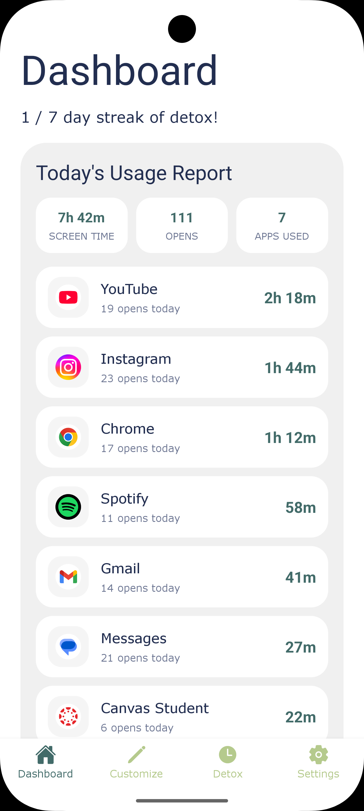
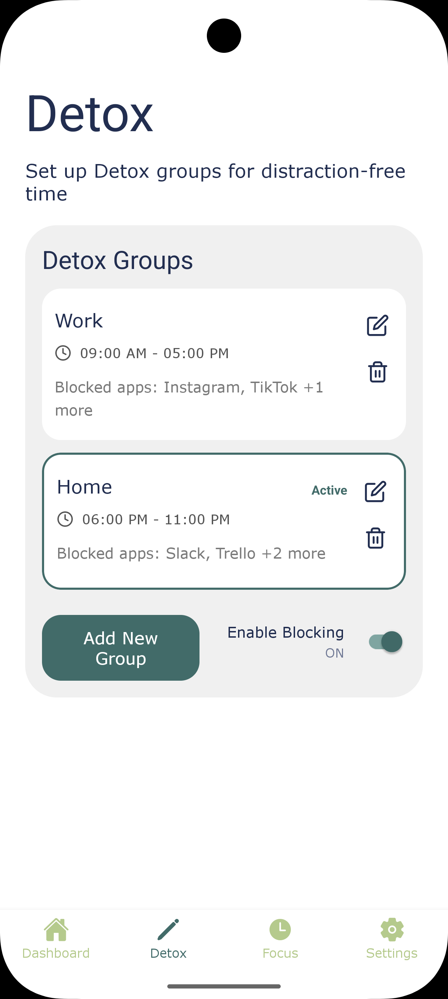
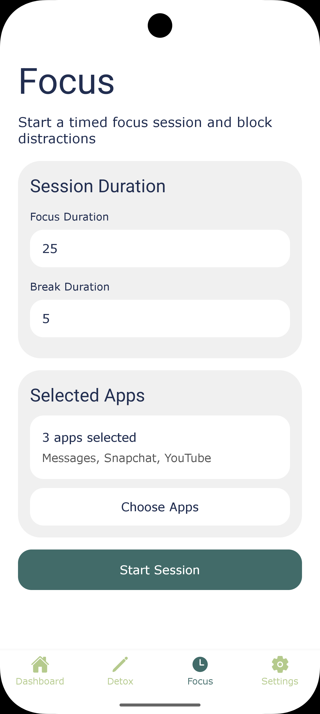
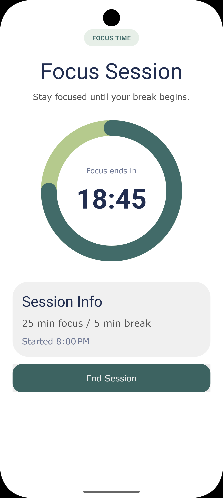
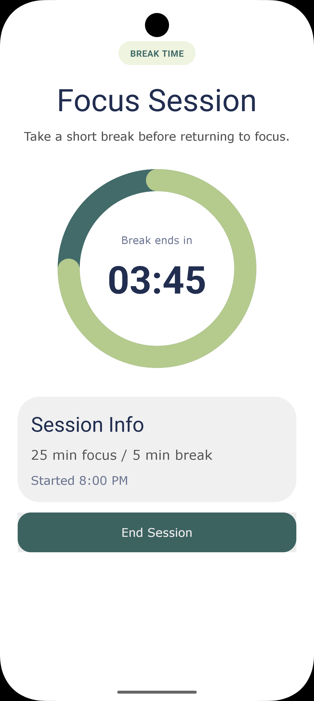
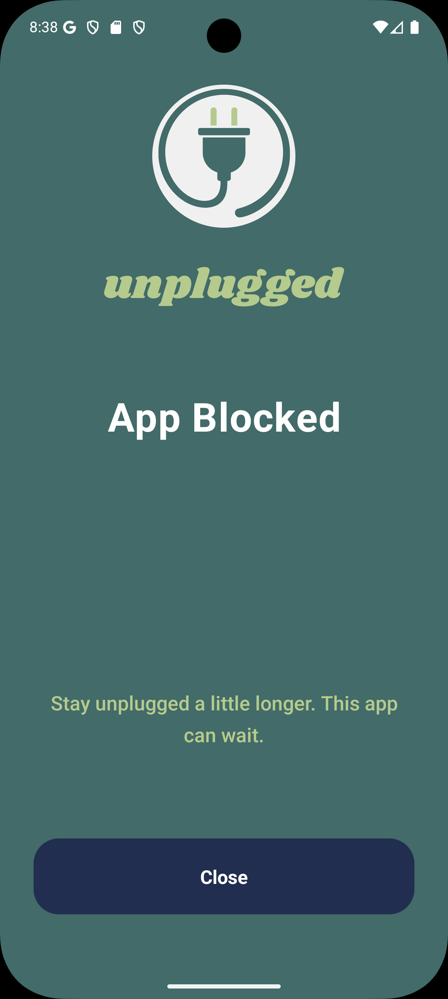

# Unplugged

Unplugged is a React Native Android digital wellbeing app that helps users reduce distractions through saved app-blocking presets and temporary timed Focus Mode sessions. The app combines a React Native product flow with native Android runtime enforcement so selected distracting apps can be blocked at the system level during study, work, or focus time.

The app is built with React Native for the main experience and native Android Kotlin for native-level app-blocking enforcement.

## Features

- Create and edit saved app-blocking groups
- Choose installed apps from the device
- Activate a saved blocker group
- Enable or disable baseline blocking
- Start temporary Focus Mode sessions
- Block additional apps during Focus Mode
- Run Focus and Break timer phases
- Show a native blocking overlay when a blocked app is opened
- View usage/stat information from the dashboard

## Screenshots










## App Sections

| Section | Purpose |
|---|---|
| Dashboard | Usage and statistics overview |
| Detox | Saved blocker groups and baseline blocking |
| Focus | Timed focus sessions |
| Settings | App settings and account options |

## Tech Stack

- React Native
- JavaScript
- Android Kotlin
- Android AccessibilityService
- Android WindowManager overlay
- AsyncStorage / local storage
- NativeModules bridge

## How It Works

Unplugged separates the user-facing app experience from the Android blocking system.

The React Native side handles the main product flow: screens, saved Detox groups, Focus Mode setup, timer UI, selected apps, and local app state. This is where users create blocker groups, choose apps, start focus sessions, and interact with the app.

The native Android side handles the device-level enforcement. It loads installed apps, stores the current blocking configuration, detects which app is currently open, and shows the blocking overlay when the user opens an app that should be blocked.

Users can create saved Detox groups for apps they want to block regularly. When a Detox group is active, those apps become the normal active blocking set.

Focus Mode builds on top of that behavior. During a Focus session, the app can temporarily add extra apps to the active blocking set. When the Focus session ends, stops, or moves into a break, those temporary Focus apps are removed and the app returns to the saved Detox group behavior.

This keeps saved blocker groups and temporary Focus sessions separate while still letting them work together through the same native Android blocking system.

## Requirements

- Node.js
- npm
- Android Studio
- Android SDK
- Android emulator or physical Android device
- Java / Gradle environment compatible with the React Native Android project

## Setup

Clone the repository:

```bash
git clone <repository-url>
cd <repository-folder>
```

Install dependencies:

```bash
npm install
```

Start Metro:

```bash
npx react-native start
```

In a separate terminal, run the Android app:

```bash
npx react-native run-android
```

## Android Permissions

Some features require Android permissions or settings to be enabled manually:

- Accessibility Service access
- Display over other apps / overlay permission
- Usage access permission for usage statistics

The app may still open without these permissions, but app blocking and usage-stat features require the correct Android settings.

## Project Structure

```text
src/
  client/
    android/        # JavaScript wrappers for native Android modules
    helper/         # Local storage and runtime sync helpers
    navigation/     # App navigation
    screens/        # Main React Native screens

android/
  app/src/main/java/com/unplugged/
    # Kotlin native modules, blocker runtime, app picker, and overlay logic
```

## Team

| Name | Role |
|---|---|
| Justin Zeller | Backend / Database |
| Austin Wilson | Frontend |
| Macie Moronto | UI / UX |
| Parth Patel | Native Integration |
| Mario Onofrio | Testing / CI/CD |

## Known Limitations

- The main app can run without the backend service.
- Android permissions must be enabled manually for blocking-related features.
- Focus Mode uses app-level timer state rather than a full native background timer service.
- Only one baseline blocker group is active at a time.
- Behavior may vary depending on Android version, emulator setup, and permission state.

## Development Notes

The native Android layer is used for runtime enforcement because app blocking requires Android-specific capabilities that are not handled purely through React Native.

The current app is focused on local device behavior, saved blocker groups, Focus Mode sessions, and native app-blocking enforcement.